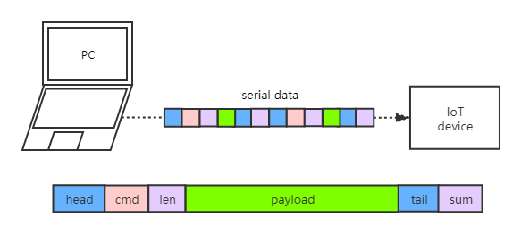

## deepvm串口传输协议设计


### 1 设计目的

deepvm串口传输协议（dstp）是为了解决电脑到IoT设备之间传输命令、文件、数据的问题。

### 2 协议特性

- 支持串口数据双向传输
- 支持自定义payload
- 分包传输

### 3 协议字段定义



协议的帧结构：帧头（head）、命令字段（cmd）、长度字段（len）、负载字段（payload）、帧尾（tail）、校验和字段（sum）。

#### 3.1 帧头（head）

该字段由**两个固定字节**（`0xFE5A`）组成，表示帧的开始。状态机会不断检查串口数据，一旦发现`0xFE5A`，便开始按照帧结构去扫描后面的串口数据。

#### 3.2 命令字段（cmd）

该字段由**一个字节**组成，表示该帧表达的功能。

主机：PC/电脑，从机：device/IoT设备。

| 命令码 | 说明               | 备注                                               |
| ------ | ------------------ | -------------------------------------------------- |
| 0x01   | 命令传输           | pc -> device，命令字符串                           |
| 0x02   | 应答ACK            | device -> pc，从机应答，payload内容可自定义        |
| 0x03   | 下发文件的参数传输 | pc -> device，参数包括文件大小、文件名、文件类型   |
| 0x04   | 下发文件的传输     | pc -> device，传输文件数据本身，支持整包和分包传输 |
| 0x05   | 自定义             | pc -> device，payload内容格式自定义                |

#### 3.3 长度字段（len）

该字段由**2个字节**组成，表示payload的字节长度。小端序，例如长度为33，该字段为0x00 0x21。

#### 3.4 负载字段（payload）

该字段由**不定长**但小于65535个字节组成。该字段内容可以是命令参数、文件内容、数据等。

##### 命令码0x01

说明：命令传输，pc -> board，命令字符串

payload字段是传递的命令字符串的具体内容，包括休止符`'\0'`。

例如：发送内存状态查询memstat，”memstat“，payload段一共8个字节。

##### 命令码0x02

说明：应答，board -> pc，下位机应答，payload内容可自定义。

例如"fail"，"ok"等。

##### 命令码0x03

说明：下发文件的参数传输，pc -> board，参数包括文件大小、文件名、文件类型

文件大小由2个字节组成，小端序，表示整个传输文件的大小。

文件名字符串，包括休止符`'\0'`，例如"hello"。

文件类型字符串，包括休止符`'\0'`，例如".dp"，".wasm"，”.ast“。

##### 命令码0x04

说明：下发文件的传输，pc -> board，传输文件数据本身，支持整包和分包传输

##### 命令码0x05

说明：自定义，pc -> device，payload内容格式自定义

#### 3.5 帧尾（tail）

该字段由**两个固定字节**（`0xFAE3`）组成，表示帧的结束。

#### 3.6 校验和字段（sum）

该字段由**一个字节**组成，表示帧头到帧尾所有字节的校验和，用于检查帧的完整性。

参考代码：

```C
/**
 * 校验和算法
 * @src 校验字符串首地址
 * @sizes 总字节数
 * @return 一个字节的校验和
 */
unsigned char checkSum(const char *src, unsigned long sizes) {
    unsigned char ret = 0;
    unsigned long i = 0;
    unsigned int sum = 0;
    const char *ptr = NULL;

    ptr = src;
    if (ptr != NULL) for (i = 0; i < sizes; i++) {
        sum += ((unsigned char*)ptr)[i];
    }
    ret = sum & 0xff;
    return ret;
}
```

