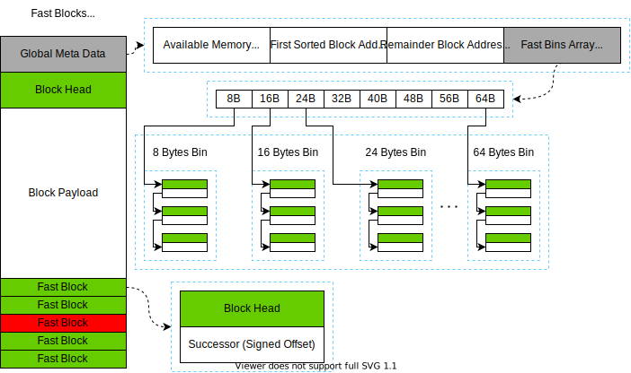
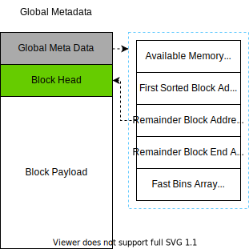
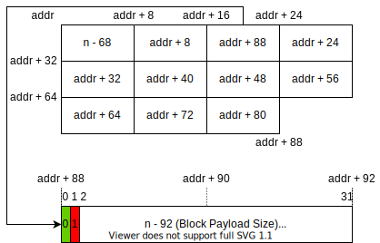
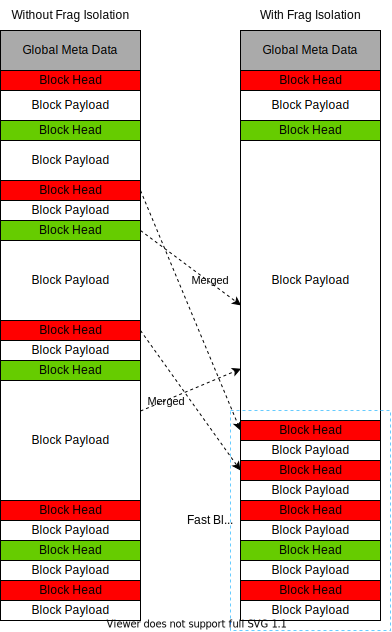
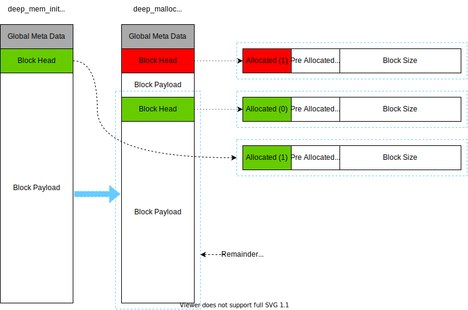

## deepvm 内存管理方案

[TOC]

### 设计目标

deepvm 内存管理是基于内存池的管理，减少内存申请和释放的时延，减少内存碎片的产生。

- 支持初始化时设置内存池大小；
- 支持内存块（block）快速分配和释放；
- 支持内存池销毁；
- 支持内存使用情况实时打印；
- 不支持内存池大小的动态伸缩；

#### 核心目标

- 确保硬件可靠情况下内存池长期可用

#### 指标权衡

- **限定单线程**环境：可以免除锁等同步机制开销
- 主要支持 IoT 环境下有限的内存大小：内存池**单池上限 4GB**（32 bit 按字节寻址），**单块上限 1GB**（30 bit 表示）
- 暂时限定 32 位寻址。
- deeplang 中受限的内存使用：**不做读写权限管理**，交由虚机与语言机制完成

#### 注意点

- 管理权问题：内存管理算法只直接管理未被分配的内存块。在一个内存块的生命周期里，内存块的管理责任经 `deep_malloc` 转移给应用程序，并由虚机调用 `deep_free` 将管理责任传递回管理模块。
  - 因此，下文所述 Fast Block, Sorted Block, Remainder Block 全都是 Free Block 的一种特化。
- 裸地址问题：裸内存地址将直接暴露给虚机其他模块，应用程序的内存使用由虚机在语言层面控制。由于可能存在的激进的内存管理方式，应用程序不应在任何时刻假设块的绝对地址数值或/及块与块之间的相对位置。

### 内存池数据结构

内存池的基本单元是内存块 block，有两种状态：**已被使用/已分配**（allocated）和**未被使用/未分配**（free）。

#### 已被使用的内存块 Allocated Block

Allocated block 分为 head, payload 和可能存在的 padding 三个部分。

- head 存储整个 block 的元信息 (meta-data)，只应通过内存管理接口读写，**对外不可见**
- payload 是外部可以**直接使用**的内存（裸内存），允许合法地直接读写
- padding (optional) 负责填充内存对齐情况下的剩余部分

| block head 的成员                    | 作用                                             |
| ------------------------------------ | ------------------------------------------------ |
| [a] allocated (1 bit)                | 指示当前 block 是否被使用，此时应为 1            |
| [p] previous block allocated (1 bit) | 标识（内存地址上紧邻着的）上一个内存块是否被使用 |
| [size] block size (30 bits)          | 记录 head + payload 内存区域的大小               |

#### 未被使用的内存块 Free Block

与 allocated block 相比，free block 没有 payload，但是（通常情况下）增添了 predecessor 和 successor 两个指针，以及 footer。

- head 和 footer 存储此 block 的元信息，在内容上**保持一致**，分别处于整个 block 的两端（最高和最低四字节）
- predecessor, successor 依序紧接着 head 排列，占据了原本的 payload 的（一部分）空间，分别存储上一个和下一个 free block 的起始位置的 **signed** offset（即当前 block 起点至对应块 head 的起始地址的偏移值），由此形成一条逻辑上的双向链表，供 bins 相关机制使用
- 块中其余空间均视为 padding，存储的值的状态在此部分**不做定义**，可能由内存管理算法使用

#### 特殊内存块：剩余块 Remainder Block

在内存池中申请一块内存。初始化内存池的时候，内存池中只有一个 free block，由下文所述 Remainder Block 地址指针直接管理。除 head 中的两个标识位外，其内所有值均不做定义。

注意，remainder block 中的 block head 应保证有 4 bytes，payload 可以至少为 0 byte。应永远存在一个 remainder block。

- allocated 应置 0
- 在 remainder block 为第一个块时，pre allocated 应置 1，其余情况下根据实际状况由其紧邻的上一个块设置。
  -  实际情况下由于合并机制的存在，P 标记可以视为恒为 1。

### 内存回收加速机制 Bins

#### 小内存快速分配 Fast Bins

内存初始化时在内存头部创建一个映射表，负责快速回收内存。

每个 fast bin 均为一个 LIFO 单向链表（即逻辑上的栈结构），保存相同大小的 free blocks，称为 fast blocks

考虑快速分配，所有的 fast blocks 一般情况下不参与空闲内存合并操作。必要时可通过其他机制整合回收。

注意，由于单向链表仅需要指向一个方向，且每条链上的所有块大小一致，fast blocks 不包含 predecessor pointer 和 footer，仅保留 head 和 successor pointer。由于每个 block 都需要一个 4-byte head 和指向另一个块的 4-bytes successor 地址，最小的 block 至少为 8 bytes。简便起见，fast bins 使用指针（绝对地址）而不是偏移值。

考虑设置以下大小的 bins[^注1]：

| Fast Bin Size (4 bytes head +  n bytes payload + padding) | Comments                                                                                      |
| --------------------------------------------------------- | --------------------------------------------------------------------------------------------- |
| 8 bytes (4 + 4)                                           | 大部分内置数值类型使用 (char / unicode char, bool, int32_t, Single precision floating number) |
| 16 bytes (4 + 12)                                         | 部分增强内置数值类型使用 (int64_t, Double precision floating number)                          |
| 24 bytes (4 + 20)                                         | 部分小型复合结构使用 (String under 20 bytes, function table with less than 5 entries)         |
| 32 bytes (4 + 28)                                         | 部分小型复合结构                                                                              |
| 40 bytes (4 + 36)                                         | 数学库：八元组                                                                                |
| 48 bytes (4 + 44)                                         | 其余结构。主要是保证 Sorted bins 的高效率                                                     |
| 56 bytes (4 + 52)                                         | 同上                                                                                          |
| 64 bytes (4 + 60)                                         | 同上，以及满足 8 bytes alignment                                                              |

[^注1]: 注1：暂时只想到了这些常见应用场景

#### 其他空余内存分配 Sorted Bins

维护所有 Fast Bins 无法维护的 blocks（在目前设计下，即所有 ≥ 72 bytes 的 free blocks），称为 sorted blocks。

Sorted Bins 在分配时允许部分分配，释放时允许邻近合并，其实现并不以时间效率为最优先。

采用跳表 Skip List 嵌套双向链表的方式维护，时间复杂度为对数级，无额外空间消耗。

##### Sorted Block 结构

- Head, predecessor, successor, footer 四个域（共 12 + 4 bytes）与前文 free blocks 设计兼容
  - 特别地，Predecessor 和 Successor 指向一个和自己**大小相同**的 Sorted Block，由此形成一个 Sorted Bin，该**双链表**上的每一个块大小相同
- 在原定 padding 区域中划出 4 + 52 bytes 共十四个域，用以保存算法需要的元信息
  - 第一个块表示该块上建立的索引层数
  - 其余 13 个域指向**对应级别索引**中的下一个块，若该块上未建立对应级别索引则该值未定义；若该块为该层级索引中最后一块，则指向自己

#### 跳表设计

将所有 sorted bin 的第一块按**大小升序**连接，每个 bin 按概率随机提升成一至十三级索引，依序填充在该 sorted bin 的第一块的 17 – 68 bytes 中，具体实现参考 Redis 的实现[^注2]。第十三级索引（最低一级）形成的链表即是将**不同大小**的 sorted bin 的**头部块**按升序直接连接的单链表。

##### 参数细节

- 每层索引节点数按 / 5 的方式计算，最上层有至多 5 个节点
- 相同大小的节点在添加时直接添加到对应链表头（类似散列表中解决冲突用的链表法)，做成 **FILO 单链表**
- 在不大于 4GB 内存时时间复杂度约为 $O(\log_{5}{n})$，常数 ≤ 5，最坏情况下单次检索节点数不超过 60 个

[^注2]: 注2：参见文末引用

### 全局元信息

共 96 bytes。

#### 全局可用内存空间

8 bytes。在单线程环境下做的进一步优化。直接保存全局 free memory 大小，并在 malloc 和 free 的时候做增减操作。

#### 第一个 Sorted Block 地址/跳表首块地址

8 bytes，也是最小的 sorted block 的地址。默认指向一个大小为 72 bytes 的 fake sorted block，作为头部索引。

#### 剩余块 Remainder Block 首地址

8 bytes。即地址上最后的 free block 的首地址，用以支持一些额外的操作。

#### 剩余块 Remainder Block 尾地址

8 bytes。即地址上最后的 free block 的尾部后的一个字节的地址，用以支持一些额外的操作。

#### Fast Bins Array

$8 \times 8 \textrm{ bytes} = 64 \textrm{ bytes}$。依序保存 fast bins 中每个 bin 的第一个元素地址，empty bin head 指向自身。

### 内存池管理算法

内存池的最小管理单元就是 block。每次 deep_malloc 会产生一个新的 block。deep_free 会有一个或多个 block 消失。在内存池初始化阶段需要进行初始化操作（deep_mem_init）。

#### deep_mem_init 算法

##### 需要参数

1. 配置的可用内存池大小 `n` (Bytes)
2. 向系统申请内存的函数的指针

##### 算法描述

假设内存按字节寻址，布局方式为小端序 little-endian

1. 使用函数向系统申请 `n` bytes 大的连续内存，保存其首地址，设为 `addr`
2. 将全局可用内存空间（`addr` 处的八字节）设为 `n - 172`
3. 将跳表首块地址（`addr + 8` 处的八字节）设为 `addr + 96`
4. 初始化跳表首块 `addr + 96 – addr + 167`
   1. 将 head 设为 0，即 A/P flags 均为 0，且 block size = 0，为最小值，防止被占用
   2. 将各个 offsets 设为 0
   3. 将 level of indices 设为最大值 13
5. 将剩余块（Remainder Block）首地址（`addr + 16` 处的八字节）设为 `addr + 168`
6. 将剩余块（Remainder Block）尾地址（`addr + 24` 处的八字节）设为 `addr + n`
7. 将 Fast Bin Array （`addr + 32` – `addr + 95` 共 64 字节）每八字节为一组，均设为`NULL`
8. 将剩余块的头部（`addr + 168` – `addr + 171`）初始化
   1. 设 `m` 为 remainder block 的 payload 部分的大小，即 `m = n - 100`
   2. 将 `m` 左移 2 bits，然后将空出的两个位从低到高分别置 0, 1
   3. 示例代码 (C/C++) `*((int *)(addr + 96)) = ((n - 100) << 2) & 2`
9. 初始化完成，结果如图

#### deep_malloc 算法描述

1. 依据全局可用内存空间值判断是否有足够空间；若没有，则返回失败
2. 判断分配的内存归属 fast bins 还是 sorted bins 管理，当前设计下阈值为 72 bytes，即内存大小 n ≥ 72 bytes；后续流程参见下文
3. 若因无足够大的连续块导致分配失败，返回失败（或考虑进行内存碎片整理，待定）

##### Fast Bin

1. 计算偏移值，直接查找对应的 fast bin 下是否存在可使用的 fast block。
2. 若存在，删除对应表头元素，跳至 step 4
   - 将该 fast block 的 successor 指针更新，使其指向自身的 successor；若自身已为最后一块，则直接置为 `NULL`
3. 若不存在，在 remainder block 尾地址处切割处对应大小的 block 返回。更新 remainder block 的尾地址。
4. 更新全局可用内存空间大小。
5. 初始化将要返回的 fast block，完成后返回其 block payload 的地址。
   - Block head 的 allocated 标记置 1，pre-allocated 标记置 1，block size 置为 payload 的大小（单位为**字节**）

注：思路上进行了碎片隔离，将 size 较小的 fast block 集中于尾部进行分配以防止 sorted blocks 被间隔开无法合并。

##### Sorted Bin

1. 从跳表中找到一个 size = n 的 sorted block
2. 若存在，初始化此 block，跳至 step 5
   1. 更新 Head，将 allocated 标识位置 1
   2. 更新物理地址上紧邻的下一块的 pre allocated 标识位，置为 1
3. 若不存在，从跳表中找到所有 size ≥ 72 + n 的 sorted block 中最小的那个
4. 在该 block 中从头部划出 n bytes 返回，将剩余空间初始化为 sorted block 并插入跳表
   1. 更新该 block 信息
      1. 初始化 Head，填充 block size，更新 allocated 标识位，保持 pre allocated 标识位不变
      2. 从跳表移除此 block，注意更新索引、双向链表指针
   2. 初始化剩余空间
      1. 初始化 Head，设置 allocated 标识位为 0，pre allocated 标识位为1，设置 block size
      2. 插入跳表，根据结果更新索引和偏移值
      3. 设置 footer，从 head 拷贝所有值
5. 更新全局可用内存空间；有必要时更新 remainder block 地址
6. 返回初始化好的块的 block payload 地址

#### deep_free 算法描述

首先判断释放的内存属于 fast bins 还是 sorted bins，当前设计下阈值为 72 bytes，即内存大小 n ≥ 72 bytes。

##### Fast Bin

1. 初始化 fast block
2. 计算偏移值，将其插入对应的 fast bin 中（插入至表头）
3. 更新全局可用内存空间大小

##### Sorted Bin

1. 检查临近 free blocks 是否为可合并空块，向上向下双向扫描，若可以则进行合并
2. 初始化为 sorted block
3. 将其插入 sorted bin 的跳表中
   - 已有相同大小的 sorted block：插入至该 sorted bin 的双向链表头的**后一个位置**（避免复制索引）
   - 不存在相同大小的 sorted block：作为新的 sorted bin 的双向链表头，同时加入随机层数的索引（至少一层）
4. 更新全局可用内存空间大小；有必要时更新 remainder block 地址

###### 连续绿块的合并

释放 sorted block 时的特殊考虑，用以合并相邻的零散可用内存块

1. 检查当前块 header 中的 [p] 标记，若上块为 free block 则继续向上扫描，否则转 step 3
2. 通过 footer 的 [size] 计算出块的首地址，设该块为当前块，重复 step 1
3. 通过扫描起始块的 header 计算出下个块的首地址，检查 [a] 标记，若为 free block 则将其设为当前块且重复 step 3
4. 将 step 1–2 中扫描到的最前块至 step 3 中扫描到的最末块中所有内存空间进行合并，重新初始化成 free block (sorted blcok)

## Q & A

1. 工作在哪个层级？需要考虑和更底层的模块交互，还是直接就是最底层模块？

   - 内存管理工作在 vm 之下，类似嵌入式的 driver 层
- 内存管理已经是最底层了，它底下没有模块了
   - 依赖于 OS，直接获取一大块内存

3. 需要读写权限管理吗

   - 由语言机制层面完成，不在内存管理方案中实现

## 可能的全局内存碎片整理方案（待定）

在可用内存空间足够但无法分配足量连续内存时进行全局数据移动。暂时没有仔细考虑，待定。

## 参考资料

### glibc 堆内存管理

[Linux堆内存管理深入分析（上）](https://introspelliam.github.io/2017/09/10/Linux堆内存管理深入分析（上）/)

[Linux堆内存管理深入分析下](https://introspelliam.github.io/2017/09/15/pwn/Linux堆内存管理深入分析下/)

### 跳表

[Skip List--跳表（全网最详细的跳表文章没有之一）](https://www.jianshu.com/p/9d8296562806)

[Redis/.../t_zset (Implementation of Skip-List)](https://github.com/antirez/redis/blob/unstable/src/t_zset.c)
