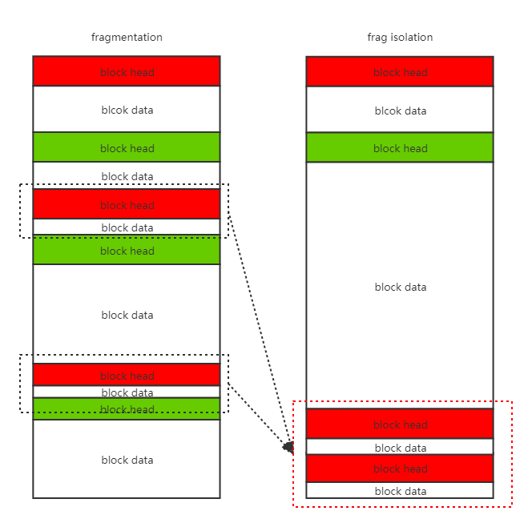
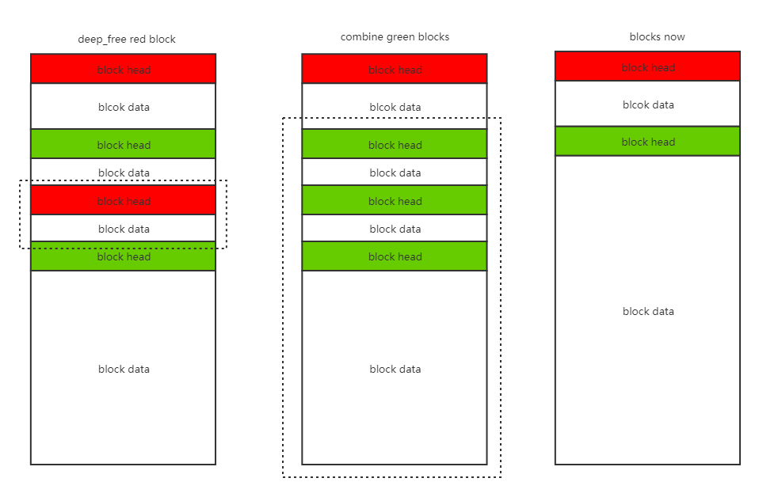

## deepvm 内存管理方案

### 设计目标

deepvm 内存管理是基于内存池的管理，减少内存申请和释放的时延，减少内存碎片的产生。

- 支持初始化时设置内存池大小；
- 支持内存块（block）快速分配和释放；
- 支持内存池销毁；
- 支持内存使用情况实时打印；
- 不支持内存池大小的动态伸缩；

#### 核心目标

- 确保硬件可靠情况下内存池长期可用

#### 指标权衡

- 限定单线程环境：可以免除锁等同步机制开销
- 主要支持 IoT 环境下有限的内存大小：内存池单池上限 4GB （32 bit 按字节寻址），单块上限 1GB（30 bit 表示）
- deeplang 中受限的内存使用：不做权限管理，交由虚机与语言机制完成

### 内存池数据结构

内存池的基本单元是内存块 block，有两种状态：已被使用（allocated）和未被使用（free）。

#### 已被使用的内存块 Allocated Block

Allocated block 分为 head, payload 和可能存在的 padding 三个部分。

- head 存储整个 block 的元信息 (meta-data)，只应通过内存管理接口读写，对外不可见
- payload 是外部可以直接使用的内存，允许合法地直接读写
- padding (optional) 负责填充内存对齐情况下的剩余部分

| block head 的成员 | 作用                                                |
| ----------------- | --------------------------------------------------- |
| [a] allocated          | 指示当前 block 是否被使用，此时应为 1                    |
| [p] previous block allocated | 标识（内存地址上紧邻着的）上一个内存块是否被使用    |
| [size] block size | 记录 payload 内存区域的大小 |

示意图（四字节一行，每列大小在表格第一行有注释，第一行与第一列列为注释）

| Size               | 30 bits (address: 31 - 2) | 1 bit (1) | 1 bit (0) |
| --------------- | ---- | ---- | --------------- |
| Head               | [size] block size         | [p] previous block allocated | [a] allocated, 1 |
| Payload |  |  | |
| ... | | | |
| padding (optional) | | | |

#### 未被使用的内存块 Free Block

与 allocated block 相比，free block 没有 payload，但是（通常情况下）增添了 predecessor 和 successor 两个指针，以及 footer。

- head 和 footer 存储此 block 的元信息，在内容上保持一致，分别处于整个 block 的两端（最高和最低四字节）
- predecessor, successor 依序紧接着 head 排列，占据了原本的 payload 的（一部分）空间，分别存储上一个和下一个 free block 的起始地址（即 head 所在的起始地址），由此形成一条双向链表
- 块中其余空间均视为 padding，存储的值的状态在此部分不做定义，可能由内存管理算法使用

示意图（四字节一行，每列大小在表格第一行有注释，第一行与第一列列为注释）

| Size               | 30 bits (address: 31 - 2) | 1 bit (1)                    | 1 bit (0)           |
| ------------------ | ------------------------- | ---------------------------- | ------------------- |
| Head               | [size] block size         | [p] previous block allocated | [a] allocated, 0    |
| Predecessor        | pointer                   | (continued) pointer          | (continued) pointer |
| Successor          | pointer                   | (continued) pointer          | (continued) pointer |
| padding (optional) |                           |                              |                     |
| ...                |                           |                              |                     |
| Footer             | [size] block size         | [p] previous block allocated | [a] allocated, 0    |

#### 特殊内存块：起始块 Remainder Block

在内存池中申请一块内存。初始化内存池的时候，内存池中只有一个 free block，由下文所述 Remainder Block 地址指针直接管理，其内所有值均为定义。

### 内存回收加速机制 Bins

内存初始化时在内存头部创建一个映射表，负责快速回收内存

TODO: 确定映射表长度。

#### 小内存快速分配 Fast Bins

每个 fast bin 均为一个 LIFO 单向链表（即逻辑上为栈结构），保存相同大小的 free blocks，称为 fast blocks

考虑快速分配，所有的 fast blocks 一般情况下不参与空闲内存合并操作。必要时可通过其他机制整合回收。

注意，由于单向链表仅需要指向一个方向，且每条链上的所有块大小一致，fast blocks 不包含 predecessor pointer 和 footer，仅保留 head 和 successor pointer。由于每个 block 都需要一个 4-byte head 和指向的 4-bytes successor 指针，最小的 block 至少为 8 bytes。

考虑设立以下大小的 bins[^注1]：

| Fast Bin Size (4 bytes head +  n bytes payload + padding) | Reason                                                       |
| --------------------------------------------------------- | ------------------------------------------------------------ |
| 8 bytes (4 + 4)                                           | 大部分内置数值类型使用（char / unicode char, bool, int32_t, Single precision floating number) |
| 16 bytes (4 + 12)                                         | 部分增强内置数值类型使用（int64_t, Double precision floating number) |
| 24 bytes (4 + 20)                                         | 部分小型复合结构使用（String under 20 bytes, function table with less than 5 entries) |
| 32 bytes (4 + 28)                                         | 部分小型复合结构                                             |
| 40 bytes (4 + 36)                                         | 数学库：八元组                                               |
| 48 bytes (4 + 44)                                         | 其余结构。主要是保证 Sorted bins 的高效率                    |
| 56 bytes (4 + 52)                                         | 同上。                                                       |
| 64 bytes (4 + 60)                                         | 同上。（以及满足 8 bytes alignment）                         |

[^注1]: 注1：暂时只想到了这些常见应用场景

#### 其他空余内存分配 Sorted Bins

维护所有 Fast Bins 无法维护的 blocks（在目前设计下，即所有 ≥ 72 bytes 的 free blocks），称为 sorted blocks。

Fast Bins 在分配时允许部分分配，释放时允许邻近合并，其实现并不以时间效率为最优先。

采用跳表 Skip List 的方式维护，时间复杂度约为 $O(\log_{5}{n})$，常数 ≤ 5，无额外空间消耗。最坏情况下单次检索节点数不超过 60 个。

#### Sorted Block 结构

- Head, predecessor, successor, footer 四个域（共 12 + 4 bytes）与前文 free blocks 设计兼容
- 在原定 padding 区域中划出 4 + 52 bytes 共十四个域，用以保存算法需要的元信息
  - 第一个块表示该块上建立的索引层数
  - 第二个块为指针，指向算法指定的另一个大小一致的 sorted block，如不存在则指向自己
  - 其余 12 个域指向对应级别索引中的下一个块，若该块上为建立对应级别索引则该值未定义；若该块为该层级索引中末位块，则指向自己

#### 跳表设计

将所有 free blocks 升序连接，每个块按概率随机提升成一至十二级索引，依序填充在 sorted block 的 21 – 68 bytes 中，具体实现参考 Redis 的实现[^注2]。

参数细节

- 每层索引节点数按 / 5 的方式计算，最上层有至多 5 个节点
- 相同大小的节点在添加时直接添加到对应链表头（类似散列表中解决冲突用的链表法)，做成 FILO 单链表

[^注2]:参见文末引用

### 额外的元信息

#### 全局可用内存空间

4 bytes。在单线程环境下做的进一步优化。直接保存全局 free memory 大小，并在 malloc 和 free 的时候做增减操作。

#### Remainder Block 地址

4 bytes。即最大的 free block 的首地址，用以支持一些额外的操作。

#### Fast Bins Array

$8 \times 4 \textrm{ bytes} = 32 \textrm{ bytes}$。依序保存 fast bins 中每个 bin 的第一个元素地址，empty bin head 指向自身。

### 内存池管理算法

内存池的最小管理单元就是 block。每次 deep_malloc 会产生一个新的 block。deep_free 会有一个或多个  block 消失。

#### deep_malloc 算法描述

首先判断分配的内存属于 fast bins 还是 sorted bins，当前设计下阈值为 72 bytes，即内存大小 n ≥ 72 bytes。

##### Fast Bin

1. 计算偏移值，直接查找对应的 fast bin 下是否存在可使用的 fast block
2. 若存在，直接返回，并将该 fast block 的 predecessor 的 successor 指针设为自身的 successor 地址；若自身已为最后一块，则直接置为 predecessor 自身的地址。跳至 step 4。
3. 若不存在，依据 remainder block 地址和其 payload 大小计算出其尾地址，在尾地址处切割处对应大小的 block 返回。更新 remainder block。
4. 更新全局可用内存空间大小。

##### 碎片隔离

将 size 较小的 fast block 集中于尾部进行分配以防止 sorted blocks 被间隔开无法合并。

##### Sorted Bin

1. 从跳表中找到一个 size = n 的 sorted block
2. 若存在，直接返回，跳至 step 5
3. 若不存在，从跳表中找到所有 size ≥ 72 + n 的 sorted block 中最小的那个
4. 在该 block 中从头部划出 n bytes 返回，将剩余空间初始化为 sorted block 并插入跳表
5. 更新全局可用内存空间；有必要时更新 remainder block 地址

#### deep_free 算法描述

首先判断释放的内存属于 fast bins 还是 sorted bins，当前设计下阈值为 72 bytes，即内存大小 n ≥ 72 bytes。

##### Fast Bin

1. 初始化 fast block
2. 计算偏移值，将其插入对应的 fast bin 中
3. 更新全局可用内存空间大小

##### Sorted Bin

1. 检查临近 free blocks 是否为可合并空块，向上向下双向扫描，若可以则进行合并
2. 初始化为 sorted block
3. 将其插入 sorted bin 的跳表中
4. 更新全局可用内存空间大小；有必要时更新 remainder block 地址

##### 连续绿块的合并

对应 sorted block

1. 检查当前块 header 中的 [p] 标记，若上块为 free block 则继续向上扫描，否则转 step 3
2. 通过 footer 的 [size] 计算出块的首地址，设该块为当前块，重复 step 1
3. 通过扫描起始块的 header 计算出下个块的首地址，检查 [a] 标记，若为 free block 则将其设为当前块且重复 step 3
4. 将 step 1–2 中扫描到的最前块至 step 3 中扫描到的最末块中所有内存空间进行合并，重新初始化成 free block (sorted blcok)

## Q & A

1. 工作在哪个层级？需要考虑和更底层的模块交互，还是直接就是最底层模块？

   - 内存管理工作在vm之下，类似嵌入式的driver层。内存管理已经是最底层了，它底下没有模块了。

   - 依赖于 OS，直接获取一大块内存

2. 需要考虑单链表效率问题吗？双联表或者留一个 Kernel 空间做统一 mapping 是不是更好？

   - 单链表效率还好，双链表也可以。我们目标 IoT 的 device 端，基本是嵌入式芯片，运行其上的 os 大都是 RTOS 没有内核态和用户态的区别。

3. 需要读写权限管理吗

   - 由语言机制层面完成，不在内存管理方案中实现

## 可能的全局内存碎片整理方案（待定）

在可用内存空间足够但无法分配足量连续内存时进行全局数据移动。暂时没有仔细考虑，待定。

## 参考资料

### glibc 堆内存管理

[Linux堆内存管理深入分析（上）](https://introspelliam.github.io/2017/09/10/Linux堆内存管理深入分析（上）/)

[Linux堆内存管理深入分析下](https://introspelliam.github.io/2017/09/15/pwn/Linux堆内存管理深入分析下/)

### 跳表

[Skip List--跳表（全网最详细的跳表文章没有之一）](https://www.jianshu.com/p/9d8296562806)

[Redis/.../t_zset (Implementation of Skip-List)](https://github.com/antirez/redis/blob/unstable/src/t_zset.c)

